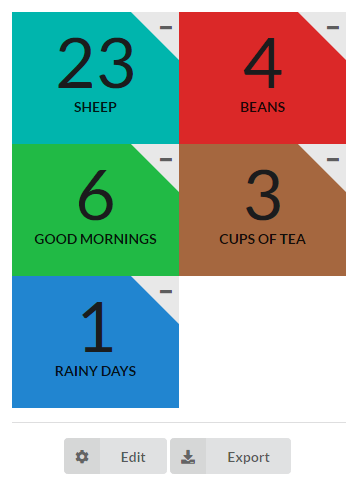

# counter-upper

A simple web app for the countable things in life.

Give your counter a name in the settings menu, and add as many more as you like.

Export the data (current count and count event timestampts) as JSON for further analysis.

All data is stored in your web browser using local storage.

